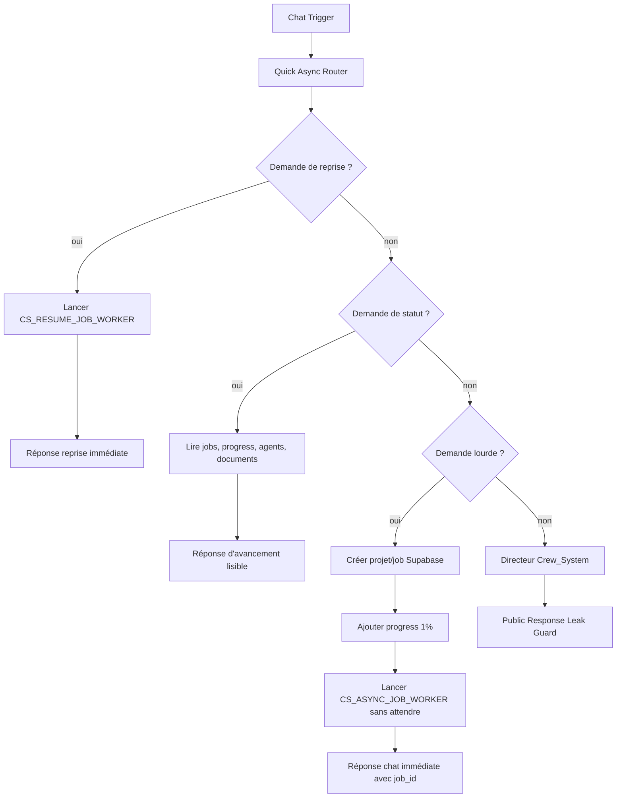

# Runtime asynchrone n8n - Crew_System

## 1. Objectif

Le chat ne doit pas porter les gros travaux.

Quand l'utilisateur demande une stratégie complète, un calendrier, un batch de contenus, un livrable Markdown ou un travail multi-agents, Crew_System doit répondre vite, créer un chantier traçable, puis laisser un worker n8n travailler en arrière-plan.

## 2. Workflows

### Workflow principal

```text
CS_CHAT_DIRECTOR_NATIVE
id: U3eGOTVq0DenA2pm
```

Rôle :

- recevoir le message du chat n8n ;
- détecter les demandes lourdes ;
- créer un job Supabase ;
- lancer le worker ;
- répondre rapidement avec l'identifiant du chantier ;
- gérer les demandes légères ou ambiguës via le Directeur IA.

### Workflow worker

```text
CS_ASYNC_JOB_WORKER
id: 7VRaCvaGkBQHFGAL
```

Rôle :

- recevoir `job_id`, `project_slug`, `request_message` ;
- marquer le job en `running` ;
- inscrire les événements de progression ;
- appeler les sous-agents utiles ;
- produire un Markdown final ;
- sauvegarder l'artifact dans Supabase ;
- créer le fichier final dans Google Drive ;
- indexer le document dans `crew_documents` ;
- marquer le job en `completed` ou `failed`.

### Workflow watchdog

```text
CS_JOB_WATCHDOG
id: WhgCmzGmZg999M2c
```

Rôle :

- lire périodiquement les jobs encore `queued` ou `running` ;
- repérer ceux qui n'ont pas bougé depuis trop longtemps ;
- ajouter un événement clair dans `crew_progress_events` ;
- écrire une erreur lisible dans `crew_errors` ;
- marquer le job en `failed` au lieu de laisser un faux statut actif.

### Workflow de reprise ciblée

```text
CS_RESUME_JOB_WORKER
id: X9T5fCVk2S98ZTSQ
```

Rôle :

- recevoir un `job_id` existant ;
- lire le job dans `crew_jobs` ;
- lire les checkpoints dans `crew_agent_runs` ;
- déterminer les agents déjà terminés ;
- relancer uniquement les agents manquants ou échoués ;
- refaire la synthèse finale ;
- créer une nouvelle version Markdown dans Google Drive ;
- remettre le job en `completed` ou `failed`.

## 3. Flux principal



## 4. Routeur rapide

Le node `Quick Async Router` protège le chat contre les timeouts.

Il route directement en arrière-plan si le message contient des signaux comme :

- `arrière-plan`, `asynchrone`, `background` ;
- `chantier complet`, `stratégie complète`, `plan complet` ;
- `calendrier éditorial`, `annuel`, `sur 1 an` ;
- `30 publications`, `70 posts`, `batch`, `production massive` ;
- `document Markdown`, `livrable final`, `Google Drive` ;
- `multi-agents`, `tous les agents`, `agents utiles` ;
- combinaison `psychologie + growth + hooks`.

Important : si l'utilisateur demande de lancer un chantier et demande aussi l'identifiant, le routeur doit quand même lancer le chantier. Le mot `job_id` ne doit pas transformer la demande en simple demande de statut.

## 5. Suivi de statut

Les demandes comme :

```text
Où en est le job job_xxx ?
Où en est le dernier chantier du projet `ecole_229` ?
Le livrable est prêt ?
```

passent par une branche déterministe.

La réponse lit :

- `crew_jobs` ;
- `crew_progress_events` ;
- `crew_documents`.

Elle affiche :

- statut humain ;
- pourcentage ;
- phase actuelle ;
- derniers événements ;
- lien Google Drive si le document est prêt ;
- raison claire et suite recommandée si le job a échoué.

## 6. Réponse rapide

Réponse attendue au lancement :

```text
C'est lancé.

Identifiant du chantier : **job_xxx**.

Les agents vont travailler en arrière-plan et produire le livrable demandé.
Tu peux me demander l'avancement avec cet identifiant.
```

Cette réponse est déterministe. Elle ne passe pas par le LLM.

Un bypass contrôlé existe dans `Public Response Leak Guard` via :

```text
is_safe_public_response = true
```

Ce bypass ne doit être utilisé que pour des réponses construites par des nodes déterministes, jamais pour une sortie brute LLM.

## 7. Worker

Le worker ne parle pas directement à l'utilisateur.

Il exécute une chaîne déterministe :

```text
Prepare Worker Input
  -> Mark Job Running
  -> Progress 10% preparing_agents
  -> Progress 14% loading_context
  -> Context Load crew_projects
  -> Context Load crew_documents
  -> Context Load crew_artifacts
  -> Context Load crew_decisions
  -> Context Load crew_agent_runs
  -> Context Load crew_jobs
  -> Build Project Context Package
  -> Progress 20% strategist
  -> Run CS_AGENT_STRATEGIST
  -> Checkpoint Strategist Agent Run
  -> Save Strategist Agent Run
  -> Progress 38% audience_psychologist
  -> Run CS_AGENT_AUDIENCE_PSYCHOLOGIST
  -> Checkpoint Audience Agent Run
  -> Save Audience Agent Run
  -> Progress 55% growth_hacker
  -> Run CS_AGENT_GROWTH_HACKER
  -> Checkpoint Growth Agent Run
  -> Save Growth Agent Run
  -> Route Hook Master?
  -> Progress 62% hook_master
  -> Run CS_AGENT_HOOK_MASTER
  -> Checkpoint Hook Agent Run
  -> Save Hook Agent Run
  -> Route Facebook Native?
  -> Progress 68% facebook_native_agent
  -> Run CS_AGENT_FACEBOOK_NATIVE
  -> Checkpoint Facebook Native Agent Run
  -> Save Facebook Native Agent Run
  -> Route LinkedIn Native?
  -> Progress 74% linkedin_native_agent
  -> Run CS_AGENT_LINKEDIN_NATIVE
  -> Checkpoint LinkedIn Native Agent Run
  -> Save LinkedIn Native Agent Run
  -> Route Calendar Architect?
  -> Progress 80% calendar_architect
  -> Run CS_AGENT_CALENDAR_ARCHITECT
  -> Checkpoint Calendar Architect Agent Run
  -> Save Calendar Architect Agent Run
  -> Route Copywriter?
  -> Progress 86% copywriter
  -> Run CS_AGENT_COPYWRITER
  -> Checkpoint Copywriter Agent Run
  -> Save Copywriter Agent Run
  -> Route Creative Director?
  -> Progress 90% creative_director
  -> Run CS_AGENT_CREATIVE_DIRECTOR
  -> Checkpoint Creative Director Agent Run
  -> Save Creative Director Agent Run
  -> Progress 94% synthesis
  -> Async Worker Directeur
  -> Worker Markdown Sanitizer
  -> Build Artifact And Completion Payload
  -> Save Final Artifact
  -> Create Final Markdown In Drive
  -> Build Document Index Payload
  -> Index Final Drive Document
  -> Add Completion Progress
  -> Mark Job Final Status
```

Ce choix rend l'avancement visible et fiable : le système ne saute plus de `10%` à `100%`, il inscrit les phases principales dans `crew_progress_events`.

### Project Context Loader

Avant de lancer le premier sous-agent, le worker charge automatiquement le contexte projet.

Sources lues :

- `crew_projects` : fiche projet ;
- `crew_documents` : documents Drive indexés ;
- `crew_artifacts` : anciens livrables Markdown et contenus sauvegardés ;
- `crew_decisions` : décisions récentes ;
- `crew_agent_runs` : mémoire récente par agent ;
- `crew_jobs` : derniers chantiers du projet.

Le node `Build Project Context Package` produit :

- `project_context_package` : contexte structuré machine ;
- `context_summary` enrichi : contexte lisible transmis à chaque agent ;
- `missing_context` : éléments absents mais non bloquants.

Règles :

- les agents ne reçoivent pas tout Supabase en vrac ;
- seuls les éléments récents et utiles sont résumés ;
- les anciens artifacts sont tronqués pour éviter de noyer le LLM ;
- Strategist reçoit le `project_context_package` dès son premier appel ;
- les autres agents reçoivent le même contexte enrichi via `context_summary` plus les sorties des agents précédents.

Objectif : éviter les générations hors contexte, réutiliser les décisions passées et donner aux agents une mémoire projet sans exposer de JSON à l'utilisateur.

Le worker route les agents selon `job_route` :

- `strategy_brief` : strategist, audience, growth, hook si utile ;
- `annual_calendar` : strategist, audience, growth, plateformes natives si utiles, calendar architect ;
- `content_batch` : strategist, audience, growth, hook, plateformes natives, copywriter, creative director ;
- `creative_batch` : strategist, audience, growth, hook, creative director.

Les pourcentages doivent toujours monter. Les valeurs de production sont maintenant ordonnées : `1 -> 10 -> 14 -> 20 -> 38 -> 55 -> 62 -> 68 -> 74 -> 80 -> 86 -> 90 -> 94 -> 100`.

Si la synthèse finale ne produit pas un Markdown exploitable commençant par `#`, le job passe en `failed` et un diagnostic Markdown est sauvegardé.

Les validateurs des sous-agents normalisent les statuts `completed`, `ready`, `ok` et `done` en `success`, pour éviter les faux échecs quand le LLM emploie un mot proche mais exploitable.

## 8. Agent Run Ledger

Chaque sous-agent écrit maintenant un checkpoint dans `crew_agent_runs`.

Chaque ligne contient :

- `agent_run_id` ;
- `job_id` ;
- `project_slug` ;
- `agent_id` ;
- `status` ;
- `input_summary` ;
- `output_summary` ;
- `handoff` complet en JSONB ;
- `quality_score` ;
- `confidence_score` ;
- `error` ;
- `started_at` ;
- `completed_at`.

Objectif :

- savoir quel agent a réussi ;
- savoir quel agent a échoué ;
- afficher l'avancement agent par agent dans le chat ;
- préparer une reprise ciblée sans relancer tout le job.

Le suivi de statut lit maintenant `crew_agent_runs` et affiche une section `Agents`.

Pour garder le chat lisible, le statut affiche la dernière ligne connue par agent et privilégie les agents attendus pour la route du job. Un checkpoint historique hors-route reste conservé dans Supabase, mais il ne doit pas polluer la réponse utilisateur.

## 9. Watchdog

Le watchdog tourne toutes les 5 minutes.

Règles prudentes :

- `queued` sans mouvement depuis 10 minutes : `failed` ;
- `running` sans mouvement depuis 30 minutes : `failed`.

Actions :

- ajout d'un événement `failed` dans `crew_progress_events` ;
- création d'une entrée dans `crew_errors` ;
- mise à jour du job avec `status = failed` ;
- conservation du pourcentage et de la phase précédente dans le message d'erreur ;
- `assistant_message` remplacé par un diagnostic Markdown lisible.

Le watchdog ne relance pas encore les jobs. Il rend les blocages visibles et empêche le chat d'afficher un faux "en cours" éternel.

## 10. Reprise ciblée

La reprise ciblée se déclenche depuis le chat avec une demande comme :

```text
Reprends le job job_xxx.
Relance le job job_xxx.
Continue le job job_xxx à partir des checkpoints.
```

Le routeur détecte :

- un `job_id` ;
- un verbe de reprise : `reprends`, `relance`, `retry`, `continue`, `poursuis`, `resume`.

Le workflow `CS_RESUME_JOB_WORKER` lit les checkpoints existants.

Règle :

- si un agent est déjà `completed`, il n'est pas relancé ;
- si un agent est `failed`, `blocked`, `missing` ou vide, il est relancé ;
- si tous les agents sont déjà terminés, seule la synthèse finale est refaite ;
- la reprise crée un nouveau fichier Markdown versionné au lieu d'écraser l'ancien.

Le worker de reprise ne se limite plus aux 4 premiers agents. Il sait reprendre les routes actuelles du worker asynchrone :

- `strategy_brief` : strategist, audience, growth, hook si utile ;
- `annual_calendar` : strategist, audience, growth, plateformes natives, calendar architect ;
- `content_batch` : strategist, audience, growth, hook, plateformes natives, copywriter, creative director ;
- `creative_batch` : strategist, audience, growth, hook, creative director.

Pour choisir la bonne route, la reprise s'appuie sur :

- la demande originale du job ;
- le type de job ;
- la phase actuelle ;
- les checkpoints déjà écrits dans `crew_agent_runs`.

Elle ne doit pas déduire la route depuis le texte du livrable final, car une synthèse de batch peut mentionner un calendrier sans devenir un job `annual_calendar`.

Cela permet d'éviter :

```text
Hook Master échoue -> on relance tout depuis Strategist
```

et de viser :

```text
Hook Master échoue -> on relance Hook Master -> on refait la synthèse
```

## 11. Persistance Supabase

Tables utilisées :

- `crew_projects` ;
- `crew_jobs` ;
- `crew_progress_events` ;
- `crew_agent_runs` ;
- `crew_artifacts` ;
- `crew_documents` ;
- `crew_errors`.

Le job garde :

- `assistant_message` ;
- `percent_estimate` ;
- `current_phase` ;
- `artifacts_created` ;
- `error` ;
- `completed_at`.

## 12. Tests validés

### Réponse rapide

Job :

```text
job_mpmv3vb2_5957e436
```

Résultat :

- réponse chat : environ 3 à 4 secondes ;
- job créé dans Supabase ;
- worker lancé sans attendre ;
- progression complète ;
- fichier Google Drive créé ;
- document indexé dans `crew_documents`.

### Suivi de job terminé

Demande :

```text
Où en est le job job_mpmv3vb2_5957e436 ?
```

Résultat :

- statut : `terminé` ;
- progression : `100%` ;
- événements récents affichés ;
- lien Google Drive affiché.

### Watchdog

Job détecté :

```text
job_mpmrpu8l_e36372cc
```

Résultat :

- ancien job `queued` depuis 133 minutes ;
- événement `failed` ajouté ;
- erreur watchdog écrite ;
- job marqué `failed` ;
- réponse de statut lisible avec raison et suite recommandée.

### Agent Run Ledger

Job :

```text
job_mpmxeflw_ffa1509e
```

Résultat :

- les 4 sous-agents ont écrit une ligne dans `crew_agent_runs` ;
- le suivi affiche les agents individuellement ;
- la progression remonte à `86%` pendant la synthèse au lieu de rester bloquée à `10%` ;
- le job termine à `100%` ;
- le document Google Drive est créé et affiché.

### Reprise ciblée

Job repris :

```text
job_mpmxeflw_ffa1509e
```

Demande :

```text
Reprends le job job_mpmxeflw_ffa1509e et recrée seulement le livrable final à partir des checkpoints agents existants.
```

Résultat :

- réponse rapide : environ 3,5 secondes ;
- `CS_RESUME_JOB_WORKER` a lu `crew_agent_runs` ;
- aucun sous-agent n'a été relancé, car les 4 checkpoints existaient déjà ;
- seule la synthèse finale a été refaite ;
- nouveau document Drive créé :

```text
https://drive.google.com/file/d/1dd6Ok7dFwSe7zo8mYaBR0HKk-i8ab-GW/view
```

### Worker routé - batch de contenus

Job :

```text
job_mpnq3t97_0f0a800c
```

Demande :

```text
Batch test : 2 publications Facebook et 1 publication LinkedIn pour la semaine du 01/06/2026 au 07/06/2026, avec brief visuel quand utile.
```

Résultat :

- réponse chat rapide : environ 3,2 secondes ;
- job exécuté en arrière-plan ;
- agents utilisés : strategist, audience_psychologist, growth_hacker, hook_master, facebook_native_agent, linkedin_native_agent, copywriter, creative_director ;
- chaque agent a écrit son checkpoint dans `crew_agent_runs` ;
- synthèse finale produite ;
- artifact Supabase créé ;
- document Google Drive créé et indexé :

```text
https://drive.google.com/file/d/1pmoKWrinivH82FyE9zCvl8HoVo_3eDXF/view
```

Correction appliquée après test :

- les pourcentages plateforme ont été réordonnés pour ne plus redescendre visuellement ;
- version installée après correction : hook 62%, Facebook 68%, LinkedIn 74%, calendar 80%, copywriter 86%, creative 90%, synthèse 94%, completion 100%.

### Reprise ciblée - worker routé

Job repris :

```text
job_mpnq3t97_0f0a800c
```

Demande :

```text
Reprends le job job_mpnq3t97_0f0a800c et recrée seulement le livrable final à partir des checkpoints agents existants.
```

Résultat validé :

- réponse rapide : environ 2,3 secondes ;
- route détectée : `content_batch` ;
- agents requis reconnus : strategist, audience_psychologist, growth_hacker, hook_master, facebook_native_agent, linkedin_native_agent, copywriter, creative_director ;
- aucun agent n'a été relancé sur la passe finale validée, car les checkpoints existaient déjà ;
- la reprise est passée directement en `resume_synthesis` ;
- nouveau document Drive créé :

```text
https://drive.google.com/file/d/1N5OUXbXn_aLynkRnwmbT2l2rYL4S37Y_/view
```

Correction appliquée pendant le test :

- une première passe avait relancé `calendar_architect` par erreur, car la route se laissait influencer par le texte du livrable final ;
- la reprise ignore maintenant le texte final pour router ;
- si des checkpoints de batch existent déjà (`copywriter`, `facebook_native_agent`, `linkedin_native_agent`), ils priment sur une mention ou un checkpoint accidentel de calendrier.

### Project Context Loader

Job :

```text
job_mpnvh0ax_021503f9
```

Demande :

```text
Lance en arrière-plan un mini test du Project Context Loader pour le projet `ecole_229` : produis une note stratégique courte en Markdown, pas plus d'une page, en utilisant le contexte projet disponible.
```

Résultat :

- réponse chat rapide : environ 1,3 seconde ;
- événement `loading_context` visible à 14% ;
- nodes exécutés : `Context Load crew_projects`, `Context Load crew_documents`, `Context Load crew_artifacts`, `Context Load crew_decisions`, `Context Load crew_agent_runs`, `Context Load crew_jobs`, `Build Project Context Package` ;
- Strategist a reçu le `project_context_package` ;
- les agents ont réutilisé le contexte des anciens livrables et agent runs ;
- job terminé à 100% ;
- document Drive créé :

```text
https://drive.google.com/file/d/1bKTYsknE5BxPfUrOgksz101CeAr-nDNu/view
```

## 13. Risques restants

À renforcer ensuite :

- retry global automatique après échec récupérable ;
- test réel d'un job partiellement échoué où seul un agent est relancé ;
- page ou commande de supervision pour afficher tous les jobs actifs ;
- alertes externes si plusieurs jobs échouent d'affilée.
