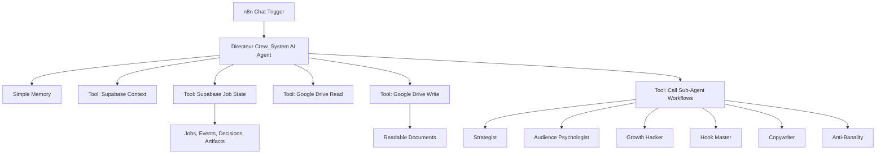

# Blueprint n8n Chat Natif - Crew_System

## 1. Decision Actuelle

On ne commence plus par l'interface Next.js ni par Vercel.

On commence par le chat natif de n8n.

Objectif :

> Utiliser n8n comme cockpit principal de Crew_System, avec un Directeur AI Agent capable de discuter, charger le contexte, appeler ses sous-agents, utiliser Supabase, utiliser Google Drive et produire des documents lisibles.

L'interface Crew_System pourra revenir plus tard.
Pour l'instant, elle n'est pas la priorite.

## 2. Sources A Respecter

Guide local obligatoire :

- `workspace/private/n8n_reference/n8n_expert_guide.md`

Docs n8n a reverifier avant chaque implementation importante :

- Chat Trigger ;
- AI Agent ;
- Tools ;
- Simple Memory ;
- Structured Output Parser ;
- Call n8n Workflow Tool ;
- Execute Workflow ;
- Supabase node ;
- Google Drive node ;
- Error Trigger ;
- Retry on Fail.

Regle :

> Ne pas supposer que n8n fonctionne comme on l'imagine. Verifier, inspecter, puis construire.

## 3. Ce Qui Change

### Avant

```text
Interface Next.js
  -> API Vercel
  -> Supabase
  -> LLM
```

Probleme :

- timeouts cloud ;
- orchestration trop lourde pour Vercel ;
- interface prematuree ;
- n8n sous-utilise.

### Maintenant

```text
n8n Chat
  -> Directeur AI Agent
  -> Tools Supabase
  -> Tools Google Drive
  -> Sous-agents n8n
  -> Documents lisibles
```

Avantage :

- on teste directement le cerveau ;
- on evite Vercel au debut ;
- on exploite les tools n8n ;
- on avance plus vite vers un systeme utilisable ;
- on garde la robustesse par workflows, schemas, logs et retries.

## 4. Architecture Cible Initiale



## 5. Premier Workflow A Construire

Nom :

```text
CS_CHAT_DIRECTOR_NATIVE
```

Role :

> Point d'entree chat natif pour discuter avec Crew_System et lancer le Directeur.

Statut actuel :

```text
Workflow cree dans n8n.
Actif : oui.
Test API chat : succes.
Executions n8n : succes.
Tools Supabase : intégrés dans le workflow Directeur via Call n8n Workflow Tool.
Test lecture Supabase : succes.
Test ecriture job + progress event : succes.
Anciens sous-workflows Supabase de test : supprimés.
Firewall de réponse publique : installé et testé.
Tools Google Drive : installés dans le workflow Directeur comme nodes `Google Drive Tool`.
Credential Google Drive : configuré par Koudous et vérifié.
Test lecture Drive : succès.
Test création dossier + document Markdown : succès.
Test final de vérification Drive/chat : succès.
Objectif suivant : premiers sous-agents.
```

Nodes attendus :

1. `Chat Trigger`
2. `AI Agent - Directeur Crew_System`
3. `Google Gemini Chat Model`
4. `Simple Memory`
5. tools Supabase
6. tools Google Drive
7. tools sous-agents
8. `Public Response Composer`
9. `Public Response Leak Guard`
10. Structured Output si le Directeur doit renvoyer une decision machine

Important :

- le chat doit rester humain ;
- les decisions internes doivent etre structurees ;
- les documents doivent etre crees dans Drive ;
- les jobs et progress doivent etre traces dans Supabase ;
- l'utilisateur ne doit pas voir de JSON brut sauf demande explicite.
- l'utilisateur ne doit jamais voir la sortie brute d'un agent.

## 5.1 Firewall De Réponse

Le Directeur ne répond plus directement au chat.

Flux actif :

```text
When chat message received
  -> Directeur Crew_System
  -> Public Response Composer
  -> Public Response Leak Guard
  -> réponse utilisateur
```

Le `Chat Trigger` utilise :

```text
responseMode = lastNode
```

Le dernier node est donc responsable de la réponse visible.

Document dédié :

```text
docs/N8N_RESPONSE_FIREWALL.md
```

## 5.2 Runtime Asynchrone

Les demandes lourdes ne passent plus directement par le Directeur LLM.

Flux actif :

```text
When chat message received
  -> Quick Async Router
  -> Resume Request Router
  -> Route Resume Request?
     -> oui : launch CS_RESUME_JOB_WORKER + réponse reprise rapide
     -> non : Route Status Request?
        -> oui : lire job + progress + agents + documents + réponse d'avancement
        -> non : Route Async Request?
        -> oui : create job + progress + launch CS_ASYNC_JOB_WORKER + réponse rapide
        -> non : Directeur Crew_System + firewall de réponse
```

Workflows runtime :

```text
CS_ASYNC_JOB_WORKER
CS_RESUME_JOB_WORKER
CS_JOB_WATCHDOG
```

Règle :

- une demande lourde doit répondre vite ;
- le chat donne un identifiant de chantier ;
- le suivi d'un chantier lit Supabase de façon déterministe, sans passer par une improvisation du LLM ;
- le worker appelle les agents en arrière-plan via des sub-workflows déterministes ;
- la reprise ciblée lit `crew_agent_runs`, saute les agents déjà terminés et refait seulement ce qui manque ;
- Supabase garde le statut, la progression, les checkpoints agents, les artifacts, les erreurs et l'index des documents ;
- chaque sous-agent écrit son résultat dans `crew_agent_runs` avant que le worker passe à l'agent suivant ;
- les phases visibles passent par `1%`, `10%`, `20%`, `38%`, `55%`, `72%`, `86%`, puis `100%` ;
- le document final du worker ne passe pas par le firewall chat, mais par `Worker Markdown Sanitizer` ;
- le livrable final est sauvegardé dans `crew_artifacts`, créé dans Google Drive, puis indexé dans `crew_documents` ;
- si la synthèse finale ne produit pas un Markdown exploitable, le job est marqué `failed` avec un diagnostic Markdown ;
- si un job reste bloqué trop longtemps, `CS_JOB_WATCHDOG` ajoute une progression claire, écrit une erreur et marque le job `failed`.

Document dédié :

```text
docs/N8N_ASYNC_JOB_RUNTIME.md
```

## 6. Prompt Systeme Minimal Du Directeur

```text
Tu es le Directeur de Crew_System, un OS agentique de strategie de communication.

Tu travailles depuis le chat natif de n8n.
Ta mission est de transformer les demandes de l'utilisateur en travail agentique fiable.

Tu dois :
1. discuter clairement avec l'utilisateur ;
2. comprendre l'intention ;
3. charger le contexte projet avec Supabase avant les travaux importants ;
4. lire les documents Google Drive utiles avant de produire ;
5. choisir les sous-agents selon le registre Crew_System ;
6. demander les informations manquantes quand le contexte est insuffisant ;
7. produire des documents Markdown lisibles dans Google Drive ;
8. enregistrer jobs, progress events, decisions, erreurs et artifacts dans Supabase ;
9. ne jamais publier directement sur Facebook ou LinkedIn ;
10. ne jamais annoncer un document cree sans verification ;
11. ne jamais exposer ton raisonnement interne long.

Tu dois preserver l'intensite utile :
- psychologie profonde ;
- influence assumee ;
- growth agressif mais defendable ;
- hooks forts ;
- angles tranchants.

Tu dois bloquer ou corriger seulement si une sortie est :
- fausse ;
- non prouvable ;
- abusive ;
- spammy ;
- incoherente ;
- dangereuse pour la confiance long terme.
```

## 7. Tools Du Directeur

### 7.1 Supabase

Le Directeur doit avoir des tools Supabase, pas juste une connexion abstraite.

Tools a creer :

```text
cs_supabase_load_project_context
cs_supabase_create_job
cs_supabase_update_job
cs_supabase_add_progress_event
cs_supabase_save_decision
cs_supabase_save_artifact
cs_supabase_save_error
cs_supabase_list_projects
```

Statut :

```text
14 tools Supabase intégrés dans `CS_CHAT_DIRECTOR_NATIVE`.
Chaque tool est un Call n8n Workflow Tool avec workflow JSON intégré.
Les workflows JSON intégrés utilisent le credential n8n "Supabase Crew System".
Le node Supabase classique ne doit pas etre branche directement en ai_tool.
Les anciens workflows `CS_TOOL_SUPABASE_*` ont été supprimés pour garder l'interface propre.
```

Regle d'utilisation :

- charger le contexte avant tout travail lourd ;
- creer un job pour toute strategie, calendrier, batch, revision ou analyse ;
- ajouter des progress events humains ;
- enregistrer les decisions importantes ;
- enregistrer les liens Drive des documents ;
- enregistrer les erreurs recuperables et bloquantes.

### 7.2 Google Drive

Statut :

```text
7 tools `Google Drive Tool` sont branchés au Directeur.
Le credential Drive `Google Drive Crew System` a été sélectionné par Koudous.
Les tests lecture, création et vérification sont passés.
```

Tools installés :

```text
cs_drive_search_project_folders
cs_drive_create_project_folder
cs_drive_search_documents
cs_drive_download_document_text
cs_drive_create_markdown_document
cs_drive_create_document_version
cs_drive_rename_document
```

Regle d'utilisation :

- Drive contient les documents lisibles ;
- Markdown par defaut ;
- pas de JSON comme livrable utilisateur principal ;
- pas d'ecrasement sans version ;
- pas de suppression de fichiers ;
- chercher avant de creer ;
- verification apres ecriture ;
- indexation dans Supabase quand un document important est cree.

Document dédié :

```text
docs/N8N_GOOGLE_DRIVE_TOOL_LAYER.md
```

Règle importante pour tous les prochains outils :

```text
Un AI Agent doit recevoir un node Tool, pas un node applicatif classique.
Si un Tool natif existe, on l'utilise.
Si le Tool natif n'est pas suffisant, on passe par Call n8n Workflow Tool.
```

### 7.3 Sous-Agents

Chaque sous-agent devient un tool interne appelable par le Directeur.

Statut :

```text
Première vague branchée dans `CS_CHAT_DIRECTOR_NATIVE`.
Méthode : Call n8n Workflow Tool avec mini-workflow LLM intégré.
Réponse directe utilisateur : non, handoff au Directeur.
Test sous-agent unique : succès.
Test boucle 5 sous-agents : succès.
Point d'architecture : les runs lourds doivent passer en job asynchrone avec progress events.
```

Sous-agents actifs :

```text
cs_agent_file_architect
cs_agent_strategist
cs_agent_audience_psychologist
cs_agent_growth_hacker
cs_agent_hook_master
```

Sous-agents restants :

```text
copywriter
facebook_native_agent
linkedin_native_agent
calendar_architect
anti_banality_agent
risk_reviewer
creative_director
video_agent
performance_analyst
```

Chaque sous-agent doit avoir :

- input contract ;
- prompt systeme ;
- modele IA ;
- sortie structurée ;
- validation ;
- handoff court au Directeur.

Document dédié :

```text
docs/N8N_SUB_AGENT_TOOL_LAYER.md
```

## 8. Memoire

n8n peut garder une memoire de chat.

Mais il faut distinguer :

```text
Memoire de chat n8n
  = facilite la conversation actuelle.

Supabase
  = memoire structuree d'execution.

Google Drive
  = memoire documentaire lisible.
```

Regle :

> La memoire n8n ne remplace jamais Supabase et Google Drive.

Si le chat dit une chose et que les documents disent autre chose, le Directeur doit signaler le conflit.

## 9. Sorties Structurees

Le Directeur doit parfois repondre en texte humain, parfois produire une decision structuree.

Schema `DirectorDecision` :

```json
{
  "intent_type": "create_project_from_idea | create_campaign_pack | generate_annual_calendar | generate_content_batch | revise_document | answer_project_question | show_job_status | unknown_or_ambiguous",
  "can_execute": true,
  "project_slug": "string",
  "confidence_score": 8,
  "missing_information": [],
  "required_questions": [],
  "context_level": "minimal | standard | deep | forensic",
  "required_agents": [],
  "expected_documents": [],
  "next_action": "answer_user | ask_user | run_agents | write_documents"
}
```

Schema `AgentHandoff` :

```json
{
  "agent_id": "string",
  "status": "completed | failed | skipped",
  "summary": "string",
  "key_decisions": [],
  "assumptions": [],
  "risk_flags": [],
  "confidence_score": 8,
  "quality_score": 8,
  "recommended_next_actions": []
}
```

Schema `DriveDocumentResult` :

```json
{
  "title": "string",
  "drive_file_id": "string",
  "drive_url": "string",
  "artifact_type": "strategy_doc | calendar | content_batch | visual_brief | report",
  "status": "draft | ready_for_human_review | needs_revision",
  "source_agents": []
}
```

## 10. Premier Scenario De Test

Depuis le chat n8n :

```text
Salut. Je suis Koudous DAOUDA, Le Robot.
Je veux construire ma strategie de domination Facebook et LinkedIn.
Commence par me poser les bonnes questions pour creer ma base strategique.
```

Le Directeur doit repondre :

- humainement ;
- sans jargon technique ;
- en posant peu de questions mais les bonnes ;
- en preparant la creation du projet ;
- sans generer un calendrier complet trop tot.

Questions attendues :

1. Quelle offre veux-tu vendre ou promouvoir en priorite ?
2. Qui veux-tu attirer exactement ?
3. Quelle transformation veux-tu qu'on associe a ton nom ?
4. Quel niveau d'agressivite veux-tu dans la prise de parole ?
5. Veux-tu commencer par Facebook, LinkedIn ou les deux ?

## 11. Deuxieme Scenario De Test

```text
Crée la base stratégique complète de mon profil Le Robot.
Tu peux utiliser ce que je t'ai deja donné : automatisation n8n, Python, applications web, Facebook, LinkedIn.
```

Le Directeur doit :

1. charger le contexte Supabase ;
2. chercher le dossier Drive du projet ;
3. demander les informations bloquantes si elles manquent ;
4. lancer les agents strategie, psychologie, positioning, influence, growth ;
5. produire des documents Drive lisibles ;
6. enregistrer les artifacts dans Supabase ;
7. repondre avec les liens des documents.

## 12. Ordre De Construction

### Etape 1 - Workflow Chat Directeur

- Chat Trigger ;
- Gemini Chat Model existant ;
- Simple Memory ;
- AI Agent Directeur ;
- prompt systeme minimal ;
- reponse conversationnelle propre.

### Etape 2 - Supabase Tools

- lister projets ;
- charger contexte ;
- creer job ;
- ajouter progress event ;
- sauvegarder decision ;
- sauvegarder erreur.

Statut : fait dans le workflow Directeur, avec tools intégrés et anciens workflows de test supprimés.

### Etape 3 - Google Drive Tools

- trouver dossier projet ;
- creer dossier projet ;
- lire documents ;
- ecrire document Markdown ;
- enregistrer lien artifact.

### Etape 4 - Sous-Agents Prioritaires

- Strategist ;
- Audience Psychologist ;
- Growth Hacker ;
- Hook Master ;
- Copywriter ;
- Anti-Banality ;
- File Architect.

### Etape 5 - Premier Job Reel

- creer ou completer le projet `koudous_daouda_le_robot` ;
- produire une base strategique Drive ;
- tester une demande de calendrier ;
- tester une demande de batch.

## 13. Ce Qu'on Ne Fait Pas Maintenant

Pas maintenant :

- interface Next.js ;
- Vercel ;
- publication directe ;
- systeme multi-utilisateur ;
- auth ;
- design UI ;
- workers externes.

On fait d'abord :

> un cerveau n8n qui fonctionne vraiment dans le chat.

## 14. Definition De Done

La premiere version n8n est bonne quand :

- on peut parler a Crew_System dans le chat n8n ;
- le Directeur comprend les demandes ;
- il sait demander les bonnes infos ;
- il sait appeler au moins un tool Supabase ;
- il sait appeler au moins un tool Google Drive ;
- il sait creer un document lisible ;
- il ne sort pas de JSON brut a l'utilisateur ;
- il ne fait pas de mock ;
- il log les jobs et erreurs ;
- il peut appeler au moins un sous-agent ;
- il garde une conversation propre et utile.

## 15. Position Finale

Crew_System commence maintenant comme :

```text
n8n Chat
  + Directeur AI Agent
  + Tools Supabase
  + Tools Google Drive
  + Sous-agents workflow
  + Documents Markdown lisibles
  = Strategic Communication OS utilisable depuis n8n
```

L'interface reviendra seulement quand le cerveau sera bon.
